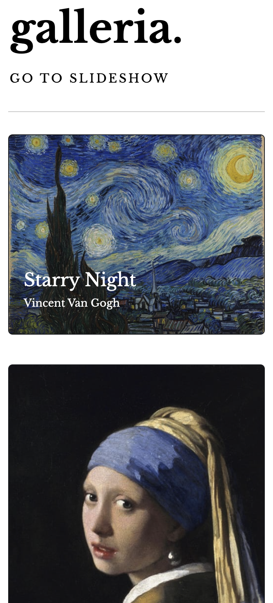
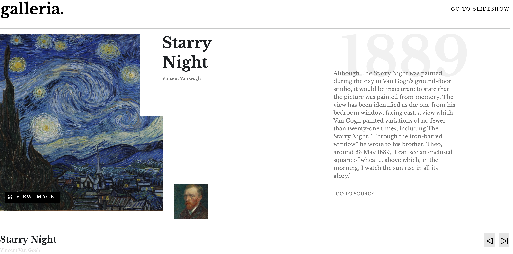
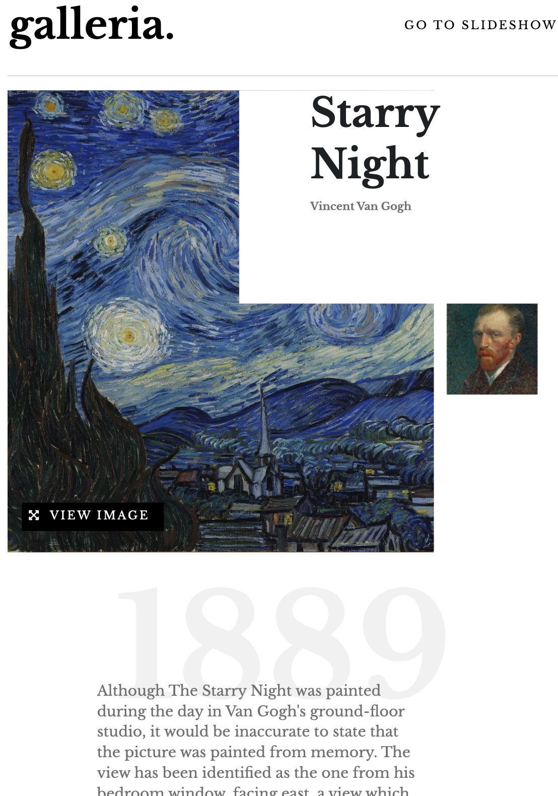

# Frontend Mentor - Galleria slideshow site solution

This is a solution to the [Galleria slideshow site challenge on Frontend Mentor](https://www.frontendmentor.io/challenges/galleria-slideshow-site-tEA4pwsa6). Frontend Mentor challenges help you improve your coding skills by building realistic projects.

## Table of contents

- [Overview](#overview)
  - [The challenge](#the-challenge)
  - [Screenshot](#screenshot)
  - [Links](#links)
- [My process](#my-process)
  - [Built with](#built-with)
  - [What I learned](#what-i-learned)
  - [Continued development](#continued-development)
  - [Useful resources](#useful-resources)
- [Author](#author)
- [Acknowledgments](#acknowledgments)

**Note: Delete this note and update the table of contents based on what sections you keep.**

## Overview

### The challenge

Users should be able to:

- View the optimal layout for the app depending on their device's screen size
- See hover states for all interactive elements on the page
- Navigate the slideshow and view each painting in a lightbox

### Screenshot

### Links

- Solution URL: [Add solution URL here](https://your-solution-url.com)
- Live Site URL: [Add live site URL here](https://j-r77-stack.github.io/Gallery-slideshow-site/index.html)

## My process

### Built with

- Semantic HTML5 markup
- CSS custom properties
- Mobile-first workflow
- [Bootstrap5](https://getbootstrap.com/)
- [Google Fonts](https://fonts.google.com/)
- [Git](https://git-scm.com/)
      * Used for version control.
- [GitHub](https://github.com/)
      * Used to store the code once pushed from Git. 

### What I learned

I learnt alot during the building of this project. First by adapting the masonary layout system to work with bootstrap5, which took quite a few tweeks.

[Link to Masonary system](https://getbootstrap.com/docs/5.0/examples/masonry/)

The building of the carousel/slider system was very tricky. I couldnt have an automatic slider and manual slider on the same page so I ended up building the on two different pages, whiched worked but wasnt exactly how I wanted it.

Also when building the project while using chrome developer tools it looked perfect on laptop, ipad and mobile, frustratingly however when i deployed the project and looked on mobile and ipad views on real devices there where some elements that where out. Going forward I want to up my skill in bootstrap5 using a mobile first aproach checking the whole time that it works correctly on all devices.

### Continued development

Continue to improve my Bootstrap5 skills.
I was going to practice using Json in this project but decided to concentrate on other things. I want to practice using Json in the next project

### Useful resources

- [Automatic Slider](https://codepen.io/SitePoint/pen/zqVGQK) - This helped me build my own slider I really liked the way it worked and will use it going forward.
- [Manual Carousel](https://www.youtube.com/watch?v=9HcxHDS2w1s) - This is an amazing YouTube Vidio which helped me understand how to build a Carousel with images. I'd recommend it to anyone still learning this concept.
- [w3schools](https://www.w3schools.com/) - A great webpage for someone beginning their journey with code.
- [stackoverflow](https://stackoverflow.com/) - Another very useful site.

## Author
- Frontend Mentor - [@J-R77-stack](https://www.frontendmentor.io/profile/J-R77-stack)
- Linkedin - [@johnny-ramsay](https://www.linkedin.com/in/johnny-ramsay-developer/)

## Acknowledgments

- [WebdevSimplified](https://courses.webdevsimplified.com/) - A great programer who really breaks down how to code in a simplified manner. I build my manual carousel using his YouTube video above.

